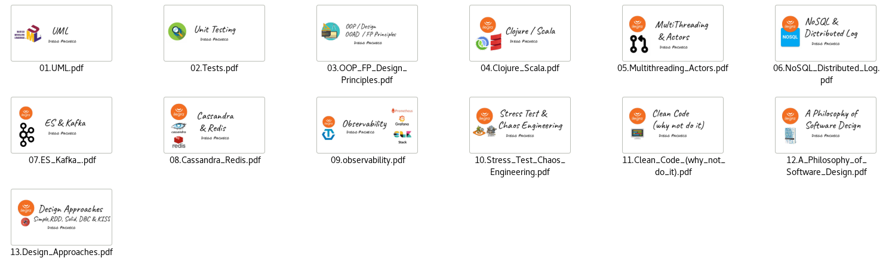

# Software Design Course / ELs Course

It's a entire course on software design

## Content

1.  UML
2.  Tests
3.  OOP Design / OOAD & FP Principles
4.  Clojure & Scala
5.  Multi-threading / Actors
6.  NoSQL & Distributed Log
7.  ES & Kafka
8.  Cassandra & Redis
9.  Observability
10. Stress Testing & Chaos Engineering
11. Clean Code(why not do it)
12. Philosophy of software Design
13. Design Approaches(Simple,KISS, RDD, DBC, SOLID)

## Decks

* UML -> https://www.slideshare.net/diego.pacheco/uml-189028484
* Tests -> https://www.slideshare.net/diego.pacheco/unit-testing-traning
* OOP & FP Design -> https://www.slideshare.net/diego.pacheco/oop-design-fp-design
* Scala & Clojure -> https://www.slideshare.net/diego.pacheco/clojure-scala
* Multithreading & Actors -> https://www.slideshare.net/diego.pacheco/multithreading-and-actors
* NoSQL & Distributed Log -> https://www.slideshare.net/diego.pacheco/nosql-distributed-log
* ES & Kafka -> https://www.slideshare.net/diego.pacheco/es-kafka
* Cassandra & Redis -> https://www.slideshare.net/diego.pacheco/cassandra-redis
* Observability -> https://www.slideshare.net/diego.pacheco/observability-214374766 
* Stress Test & Chaos Engineering -> https://www.slideshare.net/diego.pacheco/stress-test-chaos-engineering
* Clean Code (Why not to do it) -> https://www.slideshare.net/diego.pacheco/clean-code-why-not-do-it
* A Philosophy of Software Design -> https://www.slideshare.net/diego.pacheco/a-philosophy-of-software-design-216195353
* Design Approaches(Simple,KISS, RDD, DBC, SOLID) -> https://www.slideshare.net/diego.pacheco/design-approachessimple-kiss-rdd-dbc-solid

## Homeworks 

On each Deck there are homeworks. 

## Ho to use this REPO

First of all you FORK it, read all the DECKS and them code the exercises,  
create a folder *homeworks* and create a folder with the name of the homework. i.g: homeworks/1.UML/ drop the files there. 

## Recommend Reading

* [Amazon Builder Library: Review Notes](http://diego-pacheco.blogspot.com/2020/01/amazon-builder-library-review-notes.html)
* [Why do we need a Clean Code DETOX?](http://diego-pacheco.blogspot.com/2020/01/why-do-we-need-clean-code-detox.html)
* [Internal System Design: The Forgotten Discipline](http://diego-pacheco.blogspot.com/2018/05/internal-system-design-forgotten.html)
* [My 2 cents on TDD](http://diego-pacheco.blogspot.com/2017/03/my-2-cents-on-tdd.html)
* [SOA Contract Testing](http://diego-pacheco.blogspot.com/2014/10/soa-contract-testing.html)
* [Kubernetes Posts](http://diego-pacheco.blogspot.com/search?q=k8s)
* [SOA, Micro services and Isolation Evolution](http://diego-pacheco.blogspot.com/2014/11/soa-micro-services-and-isolation.html)
